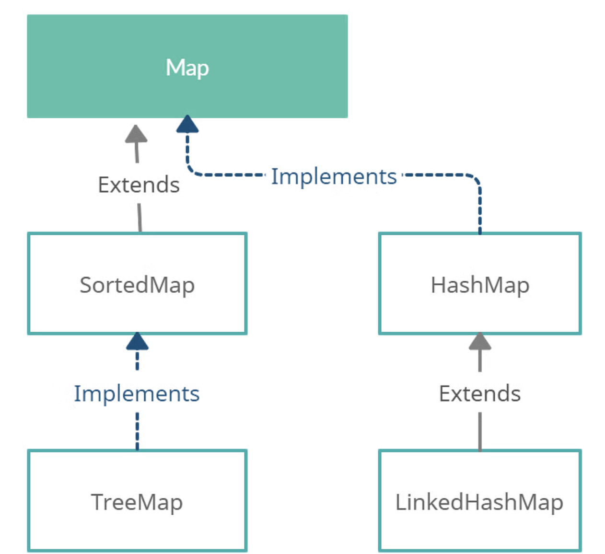

## Homework1


**1.List vs Set**

- **List (A great helper for dealing with order):** The stored elements are ordered and can be repeated.

- **Set (Focusing on uniqueness):** The stored elements cannot be repeated.

- **Queue (The queue system implementing queueing function):** Determines the order based on specific queueing rules; the stored elements are ordered and can be repeated.

- **Map (The expert in searching with keys):** Uses key-value pairs for storage, similar to the mathematical function y=f(x), where "x" represents the key and "y" represents the value. Keys are unordered and cannot be repeated, values are unordered and can be repeated, and each key maps to at most one value.

**2.LinkedList vs ArrayList**

- **Thread-Safety:** Both ArrayList and LinkedList are not synchronized, meaning they are not thread-safe.

- **Underlying Data Structure:**

  - **ArrayList:** Uses an array of Object.
  - **LinkedList:** Uses a doubly linked list structure.

- **Impact of Element Position on Insertion and Deletion:**

  - **ArrayList:** Uses an array for storage, so the time complexity for inserting and deleting elements depends on their positions.
    - For example, when using the `add(E e)` method, ArrayList will add the specified element to the end of the list, resulting in a time complexity of O(1). However, if you need to specify a position for insertion or deletion (`add(int index, E element)`), the time complexity becomes O(n) because elements after the specified position need to be shifted forward or backward by one position.
  - **LinkedList:** Uses a linked list for storage, so insertion and deletion at the head or tail do not depend on the position.
    - Methods like `addFirst(E e)`, `addLast(E e)`, `removeFirst()`, and `removeLast()` have a time complexity of O(1). However, if a position is specified for insertion or deletion (`add(int index, E element)`, `remove(Object o)`, `remove(int index)`), the time complexity is O(n) because the list needs to be traversed to the specified position for the operation.

- **Support for Random Access:**

  - **LinkedList:** Does not support efficient random access to elements.
  - **ArrayList:** Supports efficient random access (implements the `RandomAccess` interface), allowing quick access to elements by index using the `get(int index)` method.

- **Space Overhead:**
  - **ArrayList:** The primary space overhead comes from reserving a certain amount of capacity in the array list's structure.
  - **LinkedList:** Each element requires more space compared to ArrayList because each node stores both data and pointers to the next and previous nodes (due to the linked list structure).

**3.What is Map Interface**



- We can implement maps in Java from two interfaces: Map and SortedMap. The SortedMap interface extends the Map interface. There are three classes to implement maps. These three classes are HashMap, LinkedHashMap, and TreeMap.
- The Java Map interface maintains three sets: keys, values, and key/values maps (mapping). It is possible to access all these sets individually.
- The Map interface in Java can be used with the classes that implement it, to perform various operations. Some of the primary operations we can perform on the maps in Java are:

  - Adding elements
  - Removing elements
  - Changing elements
  - Iterating through the map

**4.How does HashMap work**

- Before JDK 1.8, HashMap used an array and linked list combination for storing entries.

  - The location to store an element was determined by hashing the key and then using the formula `(n - 1) & hash` (where `n` is the array length).
  - If a collision occurred (i.e., two keys hash to the same index), a linked list was used to store the entries at that index.
  - If the keys were the same, the value was updated; if not, the new entry was added to the linked list.

- After JDK 1.8, HashMap improved its collision handling.
  - If a bucket's linked list grows beyond a certain threshold (default is 8), it gets converted into a red-black tree, which offers faster search times than a linked list.
  - However, before converting to a tree, if the array size is less than 64, the array is resized instead.
  - This reduces the likelihood of needing a tree and optimizes performance.

**5.What is hash collision**

A hash collision occurs when two different keys in a hash table (like a HashMap) produce the same hash value and thus map to the same index in the underlying array. This means that both keys would be stored in the same bucket.

1. **Hash Function**: A hash function converts a key into a hash code, which is then used to determine the index in the array where the value will be stored.

2. **Collision**: When two different keys produce the same hash code, they map to the same index in the array, leading to a collision.

**Handling Hash Collisions**:

- **Chaining**: This is the method used before JDK 1.8 and involves storing colliding entries in a linked list at the same index.
- **Open Addressing**: This involves finding another empty slot within the array through probing.

- **Treeification**: Starting from JDK 1.8, if a bucket's linked list exceeds a certain length (default is 8), it is transformed into a red-black tree for better performance.

**6.What is Collections used for**

Java Collections offer a more flexible and efficient way to store multiple data objects compared to arrays. The Java Collections framework includes various classes and interfaces that can handle different types and quantities of objects, providing a wide range of operations. The advantages of Java Collections over arrays include:

1. **Dynamic Sizing**: Collections can grow or shrink in size dynamically, unlike arrays which have a fixed size.
2. **Generics Support**: Collections support generics, allowing for type-safe data storage and retrieval.
3. **Built-in Algorithms**: Collections come with built-in methods for sorting, searching, and manipulating data.

**7.What is immutable class**

An immutable class is a class in programming whose instances cannot be modified after they are created. Once an immutable object is initialized with a set of values (its state), that state cannot be changed. Immutable classes are particularly useful in situations where you want to ensure that an object's state remains constant throughout its lifetime, which can help in writing safer, more predictable code.

### Characteristics of Immutable Classes:

1. **State cannot be modified**: The state of an immutable object is set during its creation and cannot be changed afterwards.

2. **Thread-safe**: Immutable objects are inherently thread-safe because their state cannot be altered once created.

3. **Simplicity**: They are often simpler to understand and use, as they do not have mutable state and side effects.

### How to Create an Immutable Class:

To create an immutable class, you typically follow these guidelines:

1. **Declare the class as `final`**: This prevents other classes from extending it, which could potentially add mutable behavior through subclassing.

2. **Make fields `private` and `final`**: This ensures that fields cannot be accessed or modified directly from outside the class and prevents them from being reassigned once initialized.

3. **Do not provide setter methods**: Since you want to prevent modification of the object's state after creation, do not provide any methods that modify the state of the object.

4. **Ensure mutable fields are deeply copied or made immutable**: If your class contains references to mutable objects (e.g., collections), ensure that those objects are either deeply copied during construction or encapsulated in a way that prevents external modification.

5. **Constructors for initialization**: Provide constructors or factory methods that initialize all the fields of the object. Once the object is initialized, its state remains constant.

6. **Avoid mutable return types**: If your class has methods that return references to mutable objects (like arrays or collections), make sure those objects are also immutable or are not shared externally.

### Example of Immutable Class with a Collection:

```java
import java.util.Collections;
import java.util.List;

public final class ImmutablePerson {
    private final String name;
    private final int age;
    private final List<String> hobbies;

    public ImmutablePerson(String name, int age, List<String> hobbies) {
        this.name = name;
        this.age = age;
        // Create a defensive copy of the list or use an unmodifiable list to ensure immutability
        this.hobbies = Collections.unmodifiableList(hobbies);
    }

    public String getName() {
        return name;
    }

    public int getAge() {
        return age;
    }

    public List<String> getHobbies() {
        return hobbies;  // Returns an unmodifiable view of the hobbies list
    }
}
```

In this updated example:

- `name` and `age` remain `private final` to ensure they are immutable.
- `hobbies` is also declared `private final`, indicating that it cannot be reassigned after initialization.
- In the constructor, `hobbies` is either assigned a defensive copy of the provided list (`new ArrayList<>(hobbies)`), or in this case, an unmodifiable view of the list (`Collections.unmodifiableList(hobbies)`). Using `Collections.unmodifiableList()` ensures that the `hobbies` list cannot be modified externally after the `ImmutablePerson` object is created.

### 8. HashTable vs HashMap vs ConcurrentHashMap

**HashTable:**

- **Thread Safety**: Synchronized, thus thread-safe.
- **Null Values/Keys**: Does not allow any null keys or values.
- **Performance**: Slower due to synchronization.
- **Legacy**: Considered legacy and part of the original version of Java.

**HashMap:**

- **Thread Safety**: Not synchronized, thus not thread-safe.
- **Null Values/Keys**: Allows one null key and multiple null values.
- **Performance**: Faster due to lack of synchronization.
- **Usage**: Preferred for non-thread-safe operations.

**ConcurrentHashMap:**

- **Thread Safety**: Thread-safe and designed for concurrent access.
- **Null Values/Keys**: Does not allow null keys or values.
- **Performance**: Better performance in concurrent environments due to segment locking.
- **Usage**: Suitable for high-concurrency situations.

### 9. String vs StringBuilder vs StringBuffer

**String:**

- **Mutability**: Immutable.
- **Thread Safety**: Thread-safe (since immutable).
- **Performance**: Slower for concatenation due to creating new objects.

**StringBuilder:**

- **Mutability**: Mutable.
- **Thread Safety**: Not thread-safe.
- **Performance**: Faster for string manipulation as it doesn't create new objects.

**StringBuffer:**

- **Mutability**: Mutable.
- **Thread Safety**: Thread-safe (methods are synchronized).
- **Performance**: Slower than StringBuilder due to synchronization but faster than String for string manipulation.

### 10. Comparator vs Comparable

**Comparable:**

- **Usage**: Used for natural ordering.
- **Method**: `compareTo(Object o)` method.
- **Implementation**: Implemented by the class whose instances are being compared.
- **Single Sort Sequence**: Only one sort sequence.

**Comparator:**

- **Usage**: Used for custom ordering.
- **Method**: `compare(Object o1, Object o2)` method.
- **Implementation**: Implemented by a separate class or provided as a lambda expression.
- **Multiple Sort Sequences**: Can define multiple sort sequences.

**When to Use:**

- **Comparable**: Use when natural ordering is required and when the class controls its own sorting.
- **Comparator**: Use when multiple orderings are needed or when the class does not control the sorting order.

### 11. Overriding vs Overloading

**Overriding:**

- **Definition**: Redefining a method in a subclass that already exists in the superclass.
- **Signature**: Must have the same method signature (name, parameters, return type).
- **Binding**: Runtime (dynamic) binding.
- **Purpose**: Provides specific implementation in the subclass.

**Overloading:**

- **Definition**: Defining multiple methods with the same name but different parameter lists in the same class.
- **Signature**: Must have a different method signature.
- **Binding**: Compile-time (static) binding.
- **Purpose**: Increases method readability and reusability.

### 12. JRE vs JDK vs JVM

**JRE (Java Runtime Environment):**

- **Components**: JVM, libraries, and other components to run applications.
- **Usage**: Required to run Java applications.

**JDK (Java Development Kit):**

- **Components**: JRE + development tools (compilers, debuggers).
- **Usage**: Required to develop Java applications.

**JVM (Java Virtual Machine):**

- **Components**: Execution engine that runs Java bytecode.
- **Usage**: Converts bytecode into machine code and runs it.

### 13. Java 8 Basic Data Types

**Primitive Data Types:**

- **byte**: 8-bit integer.
- **short**: 16-bit integer.
- **int**: 32-bit integer.
- **long**: 64-bit integer.
- **float**: 32-bit floating-point.
- **double**: 64-bit floating-point.
- **char**: 16-bit Unicode character.
- **boolean**: true/false.

### 14. Primitive Type vs Reference Type

**Primitive Type:**

- **Definition**: Basic data types (int, byte, char, etc.).
- **Memory**: Stored directly in the memory.
- **Size**: Fixed size.

**Reference Type:**

- **Definition**: Objects and arrays.
- **Memory**: Stores references to the actual data.
- **Size**: Not fixed (depends on the object).

## Homework2

### 1. Final Keyword

The `final` keyword in Java is used to declare constants, prevent inheritance, and ensure immutability. Its usage is threefold:

- **Final Variable**: Cannot be reassigned once a value is assigned.
- **Final Method**: Cannot be overridden by subclasses.
- **Final Class**: Cannot be subclassed.

### 2. Immutable Student Class

To create an immutable `Student` class, follow these steps:

1. Make the class `final`.
2. Declare all fields as `private` and `final`.
3. Initialize fields via constructor.
4. Provide only getter methods without setters.
5. Ensure `List<Course>` is deeply immutable.

Here is the code:

```java
import java.util.Collections;
import java.util.List;

public final class Student {
    private final int studentId;
    private final String firstName;
    private final String lastName;
    private final List<Course> courses;

    public Student(int studentId, String firstName, String lastName, List<Course> courses) {
        this.studentId = studentId;
        this.firstName = firstName;
        this.lastName = lastName;
        this.courses = Collections.unmodifiableList(courses);
    }

    public int getStudentId() {
        return studentId;
    }

    public String getFirstName() {
        return firstName;
    }

    public String getLastName() {
        return lastName;
    }

    public List<Course> getCourses() {
        return courses;
    }

    // Assuming Course class is also immutable
    public static final class Course {
        private final String courseName;
        private final String courseCode;

        public Course(String courseName, String courseCode) {
            this.courseName = courseName;
            this.courseCode = courseCode;
        }

        public String getCourseName() {
            return courseName;
        }

        public String getCourseCode() {
            return courseCode;
        }
    }
}
```

### 3. Volatile, Transient, Synchronized

**Volatile**:

- Ensures visibility of changes to variables across threads.
- Reads and writes to a volatile variable are always visible to other threads.

**Transient**:

- Prevents serialization of a field.
- When an object is serialized, transient fields are ignored.

**Synchronized**:

- Ensures that a method or block of code can only be executed by one thread at a time.
- Provides mutual exclusion and visibility guarantees.

### 4. Throw vs Throws

**throw**:

- Used to explicitly throw an exception.
- Example: `throw new IllegalArgumentException("Invalid argument");`

**throws**:

- Declares that a method can throw exceptions, notifying the caller that they must handle or declare these exceptions.
- Example: `public void myMethod() throws IOException { }`

### 5. Final vs Finally vs Finalize

**final**:

- Keyword for constants, immutability, and inheritance control.

**finally**:

- Block that executes after a `try` block, regardless of whether an exception was thrown or not.
- Used for cleanup operations.

**finalize**:

- Method called by the garbage collector before reclaiming the object's memory.
- Deprecated and not recommended for resource cleanup.

### 6. This vs Super

**this**:

- Refers to the current instance of a class.
- Used to access class members and constructors.

**super**:

- Refers to the superclass (parent class) instance.
- Used to access superclass methods, variables, and constructors.

### 7. Abstract Class vs Interface

**Abstract Class**:

- Can have both abstract methods (without body) and concrete methods (with body).
- Can have state (fields).
- Inherits a class using `extends`.

**Interface**:

- Can only have abstract methods (until Java 8, which allows default and static methods).
- Cannot have state (fields, until Java 9 which allows private methods).
- Implements a class using `implements`.

### 8. JVM Architecture

Java Virtual Machine (JVM) architecture consists of:

1. **ClassLoader Subsystem**: Loads class files.
2. **Runtime Data Area**: Includes Method Area, Heap Area, Stack Area, PC Registers, and Native Method Stacks.
3. **Execution Engine**: Executes bytecode using the Interpreter, JIT Compiler, and Garbage Collector.
4. **Native Method Interface**: Calls and manages native code (e.g., C/C++).

### 9. Java Modifier Scope

**public**:

- Accessible from anywhere.

**private**:

- Accessible only within the declared class.

**protected**:

- Accessible within the same package and subclasses.

**default (package-private)**:

- Accessible only within the same package.

### 10. Static Scope

**Static**:

- Belongs to the class rather than instances.
- Static members (fields and methods) are shared among all instances of a class.
- Can be accessed without creating an instance of the class.

### 11. How Does ClassLoader Work

ClassLoaders in Java are responsible for loading classes during runtime:

1. **Bootstrap ClassLoader**: Loads core Java classes (e.g., java.lang.\*).
2. **Extension ClassLoader**: Loads classes from the extension directories (e.g., `lib/ext`).
3. **Application ClassLoader**: Loads classes from the classpath.

Class loading process:

1. **Loading**: Reads the `.class` file and creates a byte array.
2. **Linking**: Involves verification, preparation (allocating memory for static variables), and resolution (resolving symbolic references).
3. **Initialization**: Executes static initializers and static blocks.

## Homework3

### 1. Checked vs Unchecked Exceptions in Java

**Checked Exceptions:**

- Checked at compile-time.
- Must be declared in a method or constructor's `throws` clause if they can be thrown by the execution of the method or constructor and propagated outside the method or constructor boundary.
- Examples: `IOException`, `SQLException`.

**Unchecked Exceptions:**

- Not checked at compile-time.
- Include `RuntimeException` and its subclasses.
- Do not need to be declared in a method or constructor's `throws` clause.
- Examples: `NullPointerException`, `ArithmeticException`.

### 2. Finally, Final, Finalize

**finally**:

- A block used to execute important code such as cleanup actions.
- Executes regardless of whether an exception is handled or not.

**final**:

- Keyword used to declare constants, prevent method overriding, and inheritance.
- Final variables cannot be reassigned, final methods cannot be overridden, and final classes cannot be subclassed.

**finalize**:

- A method that is called by the garbage collector before the object is reclaimed.
- Deprecated and not recommended for cleanup as it is not reliable.

### 3. Try-with-Resources

**Definition**:

- A statement that declares one or more resources, which are objects that must be closed after the program is finished with them.
- Ensures that each resource is closed at the end of the statement.

**Example**:

```java
try (BufferedReader br = new BufferedReader(new FileReader("file.txt"))) {
    // Use the resource
} catch (IOException e) {
    // Handle the exception
}
```

**Difference from ordinary try**:

- Automatic resource management. No need to explicitly close resources.

### 4. Runtime Exception

**Definition**:

- A subclass of `Exception` that indicates conditions that a reasonable application might want to catch.
- Examples include `NullPointerException`, `ArrayIndexOutOfBoundsException`.

**Example**:

```java
public class RuntimeExceptionExample {
    public static void main(String[] args) {
        String str = null;
        System.out.println(str.length()); // Throws NullPointerException
    }
}
```

### 5. NoClassDefFoundError vs ClassNotFoundException

**NoClassDefFoundError**:

- Thrown when the JVM or ClassLoader tries to load the definition of a class (class file) and cannot find the definition.
- Happens when a class was present during compilation but missing at runtime.

**ClassNotFoundException**:

- Thrown when an application tries to load a class at runtime using `Class.forName`, `ClassLoader.loadClass`, or `ClassLoader.findSystemClass` methods and the class cannot be found.

### 6. Cleanup Activities in Finally Block

- Ensures that resources such as I/O streams, database connections, etc., are closed regardless of whether an exception is thrown.
- Prevents resource leaks which can lead to memory issues and other resource exhaustion problems.

### 7. OutOfMemoryError in Exception Handling

**Definition**:

- Thrown when the JVM cannot allocate an object because it is out of memory and no more memory could be made available by the garbage collector.

### 8. Generics in Java

**Definition**:

- Allows types (classes and interfaces) to be parameters when defining classes, interfaces, and methods.
- Helps to ensure type safety and reduces the need for type casting.

**Advantages**:

- Type Safety: Ensures that the correct type is used.
- Code Reusability: Allows for more flexible and reusable code.
- Eliminates ClassCastException: At runtime due to type errors.

### 9. How Generics Work and Type Erasure

**Generics**:

- Allow classes, interfaces, and methods to operate on objects of various types while providing compile-time type safety.
- Generics in Java are implemented using type erasure, where the generic type information is removed at compile time and replaced with Object types.

**Type Erasure**:

- The process by which Java replaces all type parameters in generic types with their bounds or `Object` if the type parameters are unbounded.
- Ensures that generic type information does not exist at runtime.

### 10. Difference between List<? extends T> and List<? super T>

**List<? extends T>**:

- A list of objects of a type that is a subtype of T.
- Provides read access but not write access (except `null`).

**List<? super T>**:

- A list of objects of a type that is a supertype of T.
- Provides write access but limited read access.

### 11. Optional Class

**Definition**:

- A container object which may or may not contain a non-null value.
- Provides methods to handle the presence or absence of a value without explicitly checking for null.

**Example**:

```java
import java.util.Optional;

public class OptionalExample {
    public static void main(String[] args) {
        Optional<String> optional = Optional.ofNullable(getValue());
        System.out.println(optional.orElse("Default Value"));
        optional.orElseThrow(() -> new IllegalArgumentException("Value not present"));
    }

    private static String getValue() {
        return null; // or some value
    }
}
```

1. **`ofNullable`**:

   - `Optional.ofNullable(nullableString)` creates an `Optional` instance that contains the specified value if it is not null, otherwise it creates an empty `Optional`.

2. **`orElse`**:

   - `optionalString.orElse("Default Value")` returns the value if it is present; otherwise, it returns the specified default value ("Default Value").

3. **`orElseThrow`**:
   - `optionalString.orElseThrow(() -> new IllegalArgumentException("Value is absent"))` returns the value if it is present; otherwise, it throws the specified exception.

By using `Optional`, you can avoid explicit null checks and handle the absence of values in a more declarative and safe way.

### 12. Functional Interface

**Definition**:

- An interface with exactly one abstract method.
- Can have multiple default or static methods.
- Annotated with `@FunctionalInterface`.

**Example**:

```java
@FunctionalInterface
public interface MyFunctionalInterface {
    void execute();
}
```

### 13. Default Method

**Definition**:

- A method in an interface with a default implementation.
- Allows interfaces to have concrete methods without breaking the implementing classes.

**Example**:

```java
public interface MyInterface {
    default void defaultMethod() {
        System.out.println("Default Method");
    }
}
```

### 14. Predicate, Supplier, Consumer, Function

**Predicate**:

- Represents a boolean-valued function of one argument.

```java
Predicate<String> isEmpty = String::isEmpty;
```

**Supplier**:

- Represents a supplier of results.

```java
Supplier<String> stringSupplier = () -> "Hello, World!";
```

**Consumer**:

- Represents an operation that accepts a single input argument and returns no result.

```java
Consumer<String> print = System.out::println;
```

**Function**:

- Represents a function that accepts one argument and produces a result.

```java
Function<String, Integer> length = String::length;
```

**Example Code**:

```java
import java.util.function.*;

public class FunctionalInterfaceExample {
    public static void main(String[] args) {
        Predicate<String> isEmpty = String::isEmpty;
        Supplier<String> stringSupplier = () -> "Hello, World!";
        Consumer<String> print = System.out::println;
        Function<String, Integer> length = String::length;

        String str = stringSupplier.get();
        print.accept(str);
        System.out.println("Is empty: " + isEmpty.test(str));
        System.out.println("Length: " + length.apply(str));
    }
}
```

### 15. Method Reference

**Definition**:

- A shorthand notation of a lambda expression to call a method.
- Used to refer to a method without executing it.
- Types: Static method reference, instance method reference, constructor reference.

**Example**:

```java
Consumer<String> print = System.out::println;
print.accept("Hello, Method Reference");
```

## Homework4

### Coding Examples

Let's start with the coding part, and then move on to the theoretical questions.

**Creating the Student Class and List:**

```java
import java.util.*;
import java.util.stream.Collectors;

class Student {
    String name;
    int age;
    int score;

    public Student(String name, int age, int score) {
        this.name = name;
        this.age = age;
        this.score = score;
    }

    public String getName() {
        return name;
    }

    public int getAge() {
        return age;
    }

    public int getScore() {
        return score;
    }

    @Override
    public String toString() {
        return "Student{name='" + name + "', age=" + age + ", score=" + score + '}';
    }
}

public class StudentStreamExample {
    public static void main(String[] args) {
        List<Student> list = new ArrayList<>();
        list.add(new Student("Alice", 20, 70));
        list.add(new Student("Bob", 22, 50));
        list.add(new Student("Anna", 21, 90));
        list.add(new Student("John", 23, 45));

        // 1. Find all students’ names starting with ‘A’
        List<String> namesStartingWithA = list.stream()
                .map(Student::getName)
                .filter(name -> name.startsWith("A"))
                .collect(Collectors.toList());
        System.out.println("Names starting with 'A': " + namesStartingWithA);

        // 2. Get the sum of all the students' scores
        int sumOfScores = list.stream()
                .mapToInt(Student::getScore)
                .sum();
        System.out.println("Sum of all scores: " + sumOfScores);

        // 3. Find all the students whose score >= 60
        List<Student> studentsWithHighScore = list.stream()
                .filter(student -> student.getScore() >= 60)
                .collect(Collectors.toList());
        System.out.println("Students with score >= 60: " + studentsWithHighScore);

        // 4. Retrieve all students' names
        List<String> allNames = list.stream()
                .map(Student::getName)
                .collect(Collectors.toList());
        System.out.println("All student names: " + allNames);

        // 5. Count the frequency of each age
        Map<Integer, Long> ageFrequency = list.stream()
                .collect(Collectors.groupingBy(Student::getAge, Collectors.counting()));
        System.out.println("Age frequency: " + ageFrequency);
    }
}
```

### Intermediate vs Terminal Operations

**Intermediate Operations**:

- Return another stream.
- Lazy in nature; they are not executed until a terminal operation is invoked.
- Examples: `filter()`, `map()`, `flatMap()`, `sorted()`, `distinct()`, `limit()`, `skip()`.

**Terminal Operations**:

- Produce a result or a side effect.
- Trigger the processing of the pipeline.
- Examples: `collect()`, `count()`, `forEach()`, `reduce()`, `toArray()`, `anyMatch()`, `allMatch()`, `noneMatch()`.

### Thread Lifecycle

The thread lifecycle in Java consists of the following states:

1. **New**: A thread that is created but not yet started.
2. **Runnable**: A thread that is ready to run but waiting for CPU time.
3. **Running**: A thread that is currently executing.
4. **Blocked/Waiting**: A thread that is blocked or waiting for a monitor lock or other resource.
5. **Terminated**: A thread that has finished execution.

**State Transitions**:

- **New -> Runnable**: By calling `start()`.
- **Runnable -> Running**: When the thread scheduler selects it.
- **Running -> Blocked/Waiting**: When waiting for a resource or calling `wait()`.
- **Blocked/Waiting -> Runnable**: When the resource is available or `notify()`, `notifyAll()` is called.
- **Running -> Terminated**: When the run method completes.

### Creating a Thread

**1. Extending Thread Class**:

```java
class MyThread extends Thread {
    public void run() {
        System.out.println("Thread is running.");
    }
}

public class ThreadExample1 {
    public static void main(String[] args) {
        MyThread t1 = new MyThread();
        t1.start();
    }
}
```

**2. Implementing Runnable Interface**:

```java
class MyRunnable implements Runnable {
    public void run() {
        System.out.println("Thread is running.");
    }
}

public class ThreadExample2 {
    public static void main(String[] args) {
        Thread t2 = new Thread(new MyRunnable());
        t2.start();
    }
}
```

**3. Using Lambda Expressions**:

```java
public class ThreadExample3 {
    public static void main(String[] args) {
        Thread t3 = new Thread(() -> System.out.println("Thread is running."));
        t3.start();
    }
}
```

**4. Using Executors Framework**:

```java
import java.util.concurrent.ExecutorService;
import java.util.concurrent.Executors;

public class ThreadExample4 {
    public static void main(String[] args) {
        ExecutorService executor = Executors.newFixedThreadPool(1);
        executor.submit(() -> System.out.println("Thread is running."));
        executor.shutdown();
    }
}
```

### Thread Pool

**How It Works**:

- Manages a pool of worker threads.
- Reuses existing threads for new tasks instead of creating new ones.
- Improves performance by reducing overhead of thread creation and destruction.

### Potential Problems with `newCachedThreadPool` and `newFixedThreadPool`

**newCachedThreadPool**:

- Can potentially create an unlimited number of threads, leading to resource exhaustion.

**newFixedThreadPool**:

- The fixed number of threads may not handle sudden surges in workload effectively, causing delays or rejections.

### Future

**Definition**:

- Represents the result of an asynchronous computation.
- Provides methods to check if the computation is complete, to wait for its completion, and to retrieve the result.

### CompletableFuture

**Definition**:

- An extension of `Future` that provides additional functionalities for handling asynchronous computations.
- Supports non-blocking, declarative, and compositional programming styles.

### Future vs CompletableFuture

**Future**:

- Basic interface for representing an asynchronous computation.
- Limited functionality for chaining and combining tasks.

**CompletableFuture**:

- Enhanced with methods for chaining, combining tasks, handling results, and exceptions.
- Supports both blocking and non-blocking operations.

### Lock vs Synchronized

**Lock**:

- More flexible and scalable.
- Can try for lock without blocking.
- Supports multiple lock conditions.

**Synchronized**:

- Simpler to use.
- Automatically releases the lock.
- Limited functionality.

### wait(), notify(), notifyAll(), join()

**wait()**:

- Causes the current thread to wait until another thread invokes `notify()` or `notifyAll()` on the same object.

**notify()**:

- Wakes up a single thread that is waiting on the object's monitor.

**notifyAll()**:

- Wakes up all threads that are waiting on the object's monitor.

**join()**:

- Waits for a thread to die.
- Ensures that a thread completes its execution before the next line of code is executed.

### Example Code for Predicate, Supplier, Consumer, Function

**Example**:

```java
import java.util.function.*;

public class FunctionalInterfacesExample {
    public static void main(String[] args) {
        // Predicate
        Predicate<String> isNotEmpty = s -> !s.isEmpty();
        System.out.println(isNotEmpty.test("Hello")); // true

        // Supplier
        Supplier<String> supplier = () -> "Supplied value";
        System.out.println(supplier.get()); // Supplied value

        // Consumer
        Consumer<String> consumer = s -> System.out.println(s);
        consumer.accept("Hello, World!"); // Hello, World!

        // Function
        Function<String, Integer> function = s -> s.length();
        System.out.println(function.apply("Hello")); // 5
    }
}
```

### Method Reference

**Definition**:

- A shorthand for a lambda expression to call a method.
- Uses `::` syntax.

**Example**:

```java
import java.util.function.Consumer;

public class MethodReferenceExample {
    public static void main(String[] args) {
        Consumer<String> print = System.out::println;
        print.accept("Hello, Method Reference");
    }
}
```

## Homework5

### Deadlock

**Definition**:

- Deadlock is a situation where two or more threads are blocked forever, waiting for each other.
- It occurs when multiple threads need the same locks but obtain them in different order.

### Creating Deadlock with ReentrantLock

**Example**:

```java
import java.util.concurrent.locks.ReentrantLock;

public class DeadlockExample {
    private final ReentrantLock lock1 = new ReentrantLock();
    private final ReentrantLock lock2 = new ReentrantLock();

    public void method1() {
        lock1.lock();
        try {
            // Simulating work
            Thread.sleep(100);
            lock2.lock();
            try {
                // Critical section
            } finally {
                lock2.unlock();
            }
        } catch (InterruptedException e) {
            e.printStackTrace();
        } finally {
            lock1.unlock();
        }
    }

    public void method2() {
        lock2.lock();
        try {
            // Simulating work
            Thread.sleep(100);
            lock1.lock();
            try {
                // Critical section
            } finally {
                lock1.unlock();
            }
        } catch (InterruptedException e) {
            e.printStackTrace();
        } finally {
            lock2.unlock();
        }
    }

    public static void main(String[] args) {
        DeadlockExample example = new DeadlockExample();
        Thread t1 = new Thread(example::method1);
        Thread t2 = new Thread(example::method2);
        t1.start();
        t2.start();
    }
}
```

### Preventing Deadlock

**Prevention Techniques**:

1. **Avoid Nested Locks**: Do not acquire a lock if another lock is already held.
2. **Lock Ordering**: Always acquire locks in a predefined order.
3. **Lock Timeout**: Use `tryLock` with a timeout to avoid waiting indefinitely.

**Why Prevent**:

- Deadlocks cause the application to hang, leading to poor performance and unresponsiveness.

### CompletableFuture vs Future

**Future**:

- Basic interface for representing the result of an asynchronous computation.
- Cannot be manually completed, lacks functional programming support.

**CompletableFuture**:

- Enhanced with methods for chaining, combining tasks, handling results, and exceptions.
- Supports both blocking and non-blocking operations.

### CompletableFuture Common API

- `supplyAsync()`: Executes a Supplier asynchronously.
- `thenApply()`: Applies a function on the result.
- `thenAccept()`: Consumes the result.
- `thenRun()`: Runs a runnable after the result is available.
- `exceptionally()`: Handles exceptions.
- `join()`: Waits for the computation to complete and returns the result.

### Implementing Logic with CompletableFuture

**Example**:

```java
import java.util.concurrent.CompletableFuture;
import java.util.concurrent.ExecutionException;

public class CompletableFutureExample {
    public static void main(String[] args) {
        int initialNum = 1;

        CompletableFuture<Integer> future = CompletableFuture.supplyAsync(() -> initialNum + 10)
            .thenApply(num -> num * 4)
            .thenAcceptAsync(result -> System.out.println("Result: " + result))
            .exceptionally(ex -> {
                System.out.println("Exception: " + ex.getMessage());
                return null;
            });

        try {
            future.get();
        } catch (InterruptedException | ExecutionException e) {
            e.printStackTrace();
        }
    }
}
```

### Producer-Consumer Model Using `synchronized`

**Producer-Consumer Example**:

```java
import java.util.LinkedList;
import java.util.Queue;

public class ProducerConsumerExample {
    private final Queue<Integer> queue = new LinkedList<>();
    private final int LIMIT = 10;
    private final Object lock = new Object();

    public void produce() throws InterruptedException {
        int value = 0;
        while (true) {
            synchronized (lock) {
                while (queue.size() == LIMIT) {
                    lock.wait();
                }
                queue.offer(value++);
                lock.notify();
            }
        }
    }

    public void consume() throws InterruptedException {
        while (true) {
            synchronized (lock) {
                while (queue.isEmpty()) {
                    lock.wait();
                }
                int value = queue.poll();
                System.out.println("Consumed: " + value);
                lock.notify();
            }
        }
    }

    public static void main(String[] args) {
        ProducerConsumerExample example = new ProducerConsumerExample();
        Thread producerThread = new Thread(() -> {
            try {
                example.produce();
            } catch (InterruptedException e) {
                e.printStackTrace();
            }
        });

        Thread consumerThread = new Thread(() -> {
            try {
                example.consume();
            } catch (InterruptedException e) {
                e.printStackTrace();
            }
        });

        producerThread.start();
        consumerThread.start();
    }
}
```

### Synchronized Normal Method vs Synchronized Static Method

**Synchronized Normal Method**:

- Locks the instance (object) on which the method is called.
- Different objects of the class can execute the method concurrently.

**Synchronized Static Method**:

- Locks the `Class` object, meaning all instances of the class are locked.
- No instance of the class can execute the method concurrently.

**Example**:

```java
public class SynchronizedExample {

    public synchronized void normalMethod() {
        // Synchronized on instance
    }

    public static synchronized void staticMethod() {
        // Synchronized on class
    }
}
```

## Homework6

### Optimized Singleton Version

The most optimized version of a Singleton in Java is often referred to as the "Bill Pugh Singleton Design." It utilizes a static inner helper class to ensure thread safety and lazy initialization without synchronization overhead.

**Code**:

```java
public class Singleton {
    // Private constructor to prevent instantiation
    private Singleton() {}

    // Static inner helper class responsible for holding Singleton instance
    private static class SingletonHelper {
        // Singleton instance, created only when the class is loaded
        private static final Singleton INSTANCE = new Singleton();
    }

    // Public method to provide access to the instance
    public static Singleton getInstance() {
        return SingletonHelper.INSTANCE;
    }
}
```

**Explanation**:

1. **Private Constructor**: Ensures that no other class can instantiate the Singleton class directly.
2. **Static Inner Helper Class**: `SingletonHelper` is loaded only when it is referenced, thus creating the Singleton instance in a thread-safe, lazy-loaded manner.
3. **Static Final Instance**: `INSTANCE` is created when `SingletonHelper` is loaded, ensuring only one instance is created.
4. **Public Method**: `getInstance()` returns the Singleton instance. It triggers the loading of the `SingletonHelper` class and the creation of the Singleton instance if not already created.

### Use Cases for Singleton

- **Configuration Settings**: Where a single configuration object is used across the application.
- **Logger**: Ensures all classes use the same logging instance.
- **Caching**: Single cache instance used globally.
- **Connection Pooling**: Managing a single pool of database connections.
- **Device Communication**: Managing single access to hardware devices like printers or file systems.

### Design Patterns

#### Factory Pattern

**Use Case**:

- Creating objects without specifying the exact class of object that will be created.
- Used when the type of objects needs to be determined at runtime.

**Pros**:

- Promotes loose coupling.
- Centralized object creation.

**Cons**:

- Can introduce a large number of subclasses.
- Can complicate the code with many factory classes.

**Example**:

```java
public interface Shape {
    void draw();
}

public class Circle implements Shape {
    public void draw() {
        System.out.println("Drawing Circle");
    }
}

public class Rectangle implements Shape {
    public void draw() {
        System.out.println("Drawing Rectangle");
    }
}

public class ShapeFactory {
    public Shape getShape(String shapeType) {
        if (shapeType == null) {
            return null;
        }
        if (shapeType.equalsIgnoreCase("CIRCLE")) {
            return new Circle();
        } else if (shapeType.equalsIgnoreCase("RECTANGLE")) {
            return new Rectangle();
        }
        return null;
    }
}
```

#### Builder Pattern

**Use Case**:

- Constructing complex objects with multiple representations.
- Useful when objects need to be created with many optional parameters.

**Pros**:

- Improved readability and manageability.
- Allows immutability.

**Cons**:

- Can make the code more complex with additional classes.

**Example**:

```java
public class User {
    private String firstName;
    private String lastName;
    private int age;

    private User(UserBuilder builder) {
        this.firstName = builder.firstName;
        this.lastName = builder.lastName;
        this.age = builder.age;
    }

    public static class UserBuilder {
        private String firstName;
        private String lastName;
        private int age;

        public UserBuilder setFirstName(String firstName) {
            this.firstName = firstName;
            return this;
        }

        public UserBuilder setLastName(String lastName) {
            this.lastName = lastName;
            return this;
        }

        public UserBuilder setAge(int age) {
            this.age = age;
            return this;
        }

        public User build() {
            return new User(this);
        }
    }
}
```

#### Observer Pattern

**Use Case**:

- Used when an object (subject) needs to notify multiple objects (observers) about changes in its state.

**Pros**:

- Promotes loose coupling.
- Simplifies the subject by not needing to keep track of observers.

**Cons**:

- Can lead to memory leaks if observers are not properly removed.
- Complex dependency management.

**Example**:

```java
import java.util.ArrayList;
import java.util.List;

interface Observer {
    void update(String message);
}

class Subject {
    private List<Observer> observers = new ArrayList<>();

    public void attach(Observer observer) {
        observers.add(observer);
    }

    public void detach(Observer observer) {
        observers.remove(observer);
    }

    public void notifyObservers(String message) {
        for (Observer observer : observers) {
            observer.update(message);
        }
    }
}

class ConcreteObserver implements Observer {
    private String name;

    public ConcreteObserver(String name) {
        this.name = name;
    }

    @Override
    public void update(String message) {
        System.out.println(name + " received message: " + message);
    }
}
```

#### Decorator Pattern

**Use Case**:

- Adding functionality to objects dynamically without altering their structure.

**Pros**:

- Flexible alternative to subclassing.
- Promotes code reusability.

**Cons**:

- Can result in a large number of small classes.

**Example**:

```java
interface Shape {
    void draw();
}

class Circle implements Shape {
    public void draw() {
        System.out.println("Drawing Circle");
    }
}

abstract class ShapeDecorator implements Shape {
    protected Shape decoratedShape;

    public ShapeDecorator(Shape decoratedShape) {
        this.decoratedShape = decoratedShape;
    }

    public void draw() {
        decoratedShape.draw();
    }
}

class RedShapeDecorator extends ShapeDecorator {
    public RedShapeDecorator(Shape decoratedShape) {
        super(decoratedShape);
    }

    @Override
    public void draw() {
        decoratedShape.draw();
        setRedBorder(decoratedShape);
    }

    private void setRedBorder(Shape decoratedShape) {
        System.out.println("Border Color: Red");
    }
}
```

#### Proxy Pattern

**Static Proxy**:

- Use Case: Control access to another object.
- Pros: Simplifies client code, can provide additional functionality.
- Cons: Requires proxy class for each real subject class.

**Dynamic Proxy**:

- Use Case: Implement interfaces at runtime.
- Pros: More flexible, fewer classes to maintain.
- Cons: Less performant than static proxies.

**Static Proxy Example**:

```java
interface RealSubject {
    void request();
}

class RealSubjectImpl implements RealSubject {
    public void request() {
        System.out.println("RealSubject request");
    }
}

class Proxy implements RealSubject {
    private RealSubjectImpl realSubject;

    public Proxy() {
        this.realSubject = new RealSubjectImpl();
    }

    public void request() {
        System.out.println("Proxy request");
        realSubject.request();
    }
}
```

**Dynamic Proxy Example**:

```java
import java.lang.reflect.InvocationHandler;
import java.lang.reflect.Method;
import java.lang.reflect.Proxy;

interface RealSubject {
    void request();
}

class RealSubjectImpl implements RealSubject {
    public void request() {
        System.out.println("RealSubject request");
    }
}

class ProxyInvocationHandler implements InvocationHandler {
    private Object target;

    public ProxyInvocationHandler(Object target) {
        this.target = target;
    }

    public Object invoke(Object proxy, Method method, Object[] args) throws Throwable {
        System.out.println("Proxy before request");
        Object result = method.invoke(target, args);
        System.out.println("Proxy after request");
        return result;
    }
}

public class DynamicProxyExample {
    public static void main(String[] args) {
        RealSubject realSubject = new RealSubjectImpl();
        RealSubject proxy = (RealSubject) Proxy.newProxyInstance(
                RealSubject.class.getClassLoader(),
                new Class[]{RealSubject.class},
                new ProxyInvocationHandler(realSubject));
        proxy.request();
    }
}
```

### Reflection

**Definition**:

- The ability of a program to examine and modify its structure and behavior at runtime.
- Allows for introspection of classes, methods, and fields.

**Example**:

```java
import java.lang.reflect.Method;

public class ReflectionExample {
    public static void main(String[] args) throws Exception {
        Class<?> clazz = Class.forName("java.util.ArrayList");
        Method method = clazz.getMethod("size");
        Object instance = clazz.getDeclaredConstructor().newInstance();
        System.out.println(method.invoke(instance)); // Outputs: 0
    }
}
```

### How Annotations Work in Spring

**Definition**:

- Annotations provide metadata about the program and can be used to influence the behavior of a Spring application.

**Spring Annotations**:

- **@Component**: Marks a class as a Spring component.
- **@Autowired**: Marks a field or constructor to be injected by Spring's dependency injection.
- **@Service**: Specialization of @Component for service classes.
- **@Repository**: Specialization of @Component for DAO classes.
- **@Controller**: Specialization of @Component for MVC controllers.
- **@Configuration**: Indicates that a class contains bean definitions.
- **@Bean**: Indicates that a method produces a bean to be managed by Spring.

**Example**:

```java
import org.springframework.stereotype.Component;
import org.springframework.beans.factory.annotation.Autowired;
import org.springframework.context.annotation.AnnotationConfigApplicationContext;

@Component
class MyComponent {
    public void doWork() {
        System.out.println("Working...");
    }
}

@Component
class MyService {
    private final MyComponent component;

    @Autowired
    public MyService(MyComponent component) {
        this.component = component;
    }

    public void execute() {
        component.doWork();


    }
}

public class SpringAnnotationExample {
    public static void main(String[] args) {
        AnnotationConfigApplicationContext context = new AnnotationConfigApplicationContext(SpringAnnotationExample.class);
        MyService service = context.getBean(MyService.class);
        service.execute();
        context.close();
    }
}
```

## Homework7

### HTTP Status Codes

**200 OK**:

- The request was successful, and the server responded with the requested data.

**201 Created**:

- The request was successful, and a new resource was created as a result.

**202 Accepted**:

- The request has been accepted for processing, but the processing is not complete.

**204 No Content**:

- The request was successful, but there is no content to send back in the response.

**307 Temporary Redirect**:

- The requested resource has been temporarily moved to a different URI. The client should use the new URI for future requests.

**301 Moved Permanently**:

- The requested resource has been permanently moved to a new URI. The client should use the new URI for future requests.

**400 Bad Request**:

- The server could not understand the request due to invalid syntax.

**401 Unauthorized**:

- The client must authenticate itself to get the requested response.

**403 Forbidden**:

- The client does not have access rights to the content; the server is refusing to give the requested resource.

**404 Not Found**:

- The server cannot find the requested resource.

**500 Internal Server Error**:

- The server encountered a situation it doesn't know how to handle.

### HTTP

**HTTP (Hypertext Transfer Protocol)**:

- The foundation of any data exchange on the Web.
- A protocol used for transmitting hypermedia documents, such as HTML.
- Designed for communication between web browsers and web servers, but it can also be used for other purposes.

### HTTP Methods

**GET**:

- Requests data from a specified resource.
- Should not change the state of the resource.

**POST**:

- Submits data to be processed to a specified resource.
- Often results in a change in state or side effects on the server.

**PUT**:

- Replaces all current representations of the target resource with the uploaded content.

**DELETE**:

- Removes the specified resource.

**PATCH**:

- Applies partial modifications to a resource.

### POST vs PATCH

**POST**:

- Used to create a new resource.
- Can result in the creation of a new resource or update existing resources.

**PATCH**:

- Used to apply partial updates to a resource.
- Does not replace the entire resource but only changes the specified parts.

### POST vs PUT

**POST**:

- Creates a new resource or submits data to be processed.
- The resource created does not need to have a URI specified by the client.

**PUT**:

- Replaces the current representation of the resource with the new one.
- The client specifies the URI of the resource to be updated or created.

### TCP 3-Way Handshaking

1. **SYN**: The client sends a SYN (synchronize) packet to the server to initiate a connection.
2. **SYN-ACK**: The server responds with a SYN-ACK (synchronize-acknowledge) packet to acknowledge the request.
3. **ACK**: The client sends an ACK (acknowledge) packet to establish the connection.

### TCP vs UDP

**TCP (Transmission Control Protocol)**:

- Connection-oriented.
- Ensures reliable data transfer with error checking and correction.
- Slower but reliable.

**UDP (User Datagram Protocol)**:

- Connectionless.
- Does not guarantee reliable data transfer or error checking.
- Faster but less reliable.

### Tomcat

**Tomcat**:

- An open-source implementation of the Java Servlet, JavaServer Pages, and Java Expression Language technologies.
- A web server and servlet container developed by the Apache Software Foundation.

### Basic Components of Tomcat

- **Catalina**: The servlet container.
- **Coyote**: The connector component for handling HTTP requests and responses.
- **Jasper**: The JSP engine for compiling JSPs into servlets.
- **Cluster**: Manages large-scale deployments by handling session replication.

### Spring IOC

**Spring IOC (Inversion of Control)**:

- A principle where the control of objects or portions of a program is transferred to a container or framework.
- In Spring, it is used to manage object creation and their dependencies.

### IOC Container

**IOC Container**:

- A container that uses the IOC principle to manage the lifecycle and configuration of application objects.
- In Spring, it is represented by the `ApplicationContext` interface.

### Advantages of IOC

- **Loose Coupling**: Reduces dependency between components.
- **Easier Testing**: Facilitates unit testing.
- **Improved Code Reusability**: Components can be reused across different contexts.

### Dependency Injection (DI)

**DI (Dependency Injection)**:

- A design pattern used to implement IOC, where the control of creating objects and their dependencies is transferred to the container.

### Example Code for Dependency Injection

```java
import org.springframework.beans.factory.annotation.Autowired;
import org.springframework.stereotype.Component;

@Component
class Engine {
    public void start() {
        System.out.println("Engine started");
    }
}

@Component
class Car {
    private final Engine engine;

    @Autowired
    public Car(Engine engine) {
        this.engine = engine;
    }

    public void drive() {
        engine.start();
        System.out.println("Car is driving");
    }
}

public class DependencyInjectionDemo {
    public static void main(String[] args) {
        ApplicationContext context = new AnnotationConfigApplicationContext("com.example");
        Car car = context.getBean(Car.class);
        car.drive();
    }
}
```

**How to do Dependency Injection**:

- Using annotations like `@Autowired`, `@Inject`, and `@Resource`.
- Using XML configuration.

### @Component vs @Bean

**@Component**:

- Indicates that a class is a Spring-managed component.
- Automatically detected through classpath scanning.

**@Bean**:

- Indicates that a method produces a bean to be managed by Spring.
- Used in configuration classes to define beans.

### @Configuration

**@Configuration**:

- Indicates that a class contains bean definitions.
- Used in conjunction with `@Bean` methods to configure and instantiate beans.

### AOP (Aspect-Oriented Programming)

**AOP**:

- A programming paradigm that aims to increase modularity by allowing the separation of cross-cutting concerns (e.g., logging, security).
- Enables the clean separation of business logic from system services.

### JointPoint and Aspect in AOP

**JointPoint**:

- A specific point in the execution of a program, such as method execution or exception handling.

**Aspect**:

- A module that encapsulates advice (code) and pointcuts (where the code should be applied).

### Spring Bean Scope

- **Singleton**: One instance per Spring IOC container.
- **Prototype**: A new instance every time the bean is requested.
- **Request**: One instance per HTTP request (web application context).
- **Session**: One instance per HTTP session (web application context).
- **GlobalSession**: One instance per global HTTP session (portlet context).

## Homework9

### Why Spring Boot?

**Pros**:

1. **Simplified Setup**: Spring Boot simplifies the configuration and setup of Spring applications with its pre-configured templates and auto-configuration.
2. **Standalone Applications**: Allows creating standalone applications with embedded servers like Tomcat, Jetty, or Undertow, eliminating the need for external application servers.
3. **Convention Over Configuration**: Reduces boilerplate code and configuration, following the principle of convention over configuration.
4. **Microservices Support**: Well-suited for building microservices architecture with integrated tools and libraries.
5. **Production-Ready Features**: Includes features like metrics, health checks, and externalized configuration that are essential for production applications.
6. **Community and Ecosystem**: Large community support and a rich ecosystem of plugins and extensions.

**Cons**:

1. **Learning Curve**: Can be overwhelming for beginners due to its many features and configurations.
2. **Opinionated Defaults**: While convenient, the opinionated defaults might not suit every use case, leading to the need for custom configurations.
3. **Resource Consumption**: Embedded servers and auto-configuration can lead to higher resource consumption compared to a finely tuned traditional Spring application.

### Starting a Spring Boot Project from Scratch

1. **Using Spring Initializr**:

   - Go to [Spring Initializr](https://start.spring.io).
   - Select the project metadata (project type, language, Spring Boot version, etc.).
   - Add dependencies (e.g., Spring Web, Spring Data JPA, H2 Database).
   - Generate the project and download the zip file.
   - Extract the zip file and import the project into your IDE.

2. **Manual Setup**:
   - Create a new Maven or Gradle project.
   - Add the Spring Boot Starter Parent and necessary dependencies to `pom.xml` or `build.gradle`.
   - Create the main application class with the `@SpringBootApplication` annotation.
   - Configure application properties in `src/main/resources/application.properties`.

### @Controller vs @RestController

**@Controller**:

- Used to define a controller class.
- Typically returns views in a web application.
- Uses `@ResponseBody` to return data as JSON or XML.

**@RestController**:

- A specialized version of `@Controller`.
- Combines `@Controller` and `@ResponseBody`, automatically serializing return values to JSON/XML.
- Suitable for RESTful web services.

**Example**:

```java
@RestController
public class MyRestController {
    @GetMapping("/hello")
    public String sayHello() {
        return "Hello, World!";
    }
}
```

### @PathVariable vs @RequestParam

**@PathVariable**:

- Used to extract values from the URI path.
- Example: `/users/{id}` where `{id}` is a path variable.

**@RequestParam**:

- Used to extract query parameters from the request URL.
- Example: `/users?id=1` where `id` is a query parameter.

**Example**:

```java
@RestController
public class MyController {
    @GetMapping("/users/{id}")
    public String getUserById(@PathVariable String id) {
        return "User ID: " + id;
    }

    @GetMapping("/search")
    public String search(@RequestParam String query) {
        return "Search Query: " + query;
    }
}
```

### @RequestBody vs @ResponseBody

**@RequestBody**:

- Maps the HTTP request body to a method parameter.
- Used to read data from the request body (e.g., JSON, XML).

**@ResponseBody**:

- Maps the return value of a method to the HTTP response body.
- Used to write data directly to the response body (e.g., JSON, XML).

**Example**:

```java
@RestController
public class MyController {
    @PostMapping("/users")
    public String createUser(@RequestBody User user) {
        return "User created: " + user.getName();
    }

    @GetMapping("/hello")
    @ResponseBody
    public String sayHello() {
        return "Hello, World!";
    }
}
```

### Using @GetMapping, @PutMapping, @PostMapping, @DeleteMapping, @RequestMapping

**Examples**:

```java
@RestController
@RequestMapping("/api")
public class MyController {

    @GetMapping("/users")
    public List<User> getUsers() {
        return userService.getAllUsers();
    }

    @PostMapping("/users")
    public User createUser(@RequestBody User user) {
        return userService.saveUser(user);
    }

    @PutMapping("/users/{id}")
    public User updateUser(@PathVariable Long id, @RequestBody User user) {
        return userService.updateUser(id, user);
    }

    @DeleteMapping("/users/{id}")
    public void deleteUser(@PathVariable Long id) {
        userService.deleteUser(id);
    }

    @RequestMapping(value = "/greet", method = RequestMethod.GET)
    public String greet() {
        return "Hello!";
    }
}
```

### Spring Actuator

**Spring Actuator**:

- A sub-project of Spring Boot that provides production-ready features.
- Includes endpoints for monitoring and managing applications.
- Common endpoints: `/actuator/health`, `/actuator/info`, `/actuator/metrics`.

### Achieving Async in Spring Boot Application

**Using `@Async`**:

1. Enable asynchronous support by adding `@EnableAsync` to a configuration class.
2. Annotate methods with `@Async` to run them asynchronously.

**Example**:

```java
import org.springframework.scheduling.annotation.Async;
import org.springframework.scheduling.annotation.EnableAsync;
import org.springframework.stereotype.Service;

@Service
@EnableAsync
public class AsyncService {

    @Async
    public void asyncMethod() {
        System.out.println("Async method called");
    }
}

@RestController
public class MyController {

    private final AsyncService asyncService;

    public MyController(AsyncService asyncService) {
        this.asyncService = asyncService;
    }

    @GetMapping("/async")
    public String callAsyncMethod() {
        asyncService.asyncMethod();
        return "Async method called";
    }
}
```

## Homework10

### How Does Spring Handle Exceptions

**Spring Exception Handling**:

- Spring provides several mechanisms to handle exceptions in a consistent and maintainable way.

1. **@ExceptionHandler**:

   - Used in a controller to handle specific exceptions.
   - Example:

     ```java
     @Controller
     public class MyController {

         @ExceptionHandler(MyException.class)
         public ResponseEntity<String> handleMyException(MyException ex) {
             return new ResponseEntity<>(ex.getMessage(), HttpStatus.BAD_REQUEST);
         }

         @GetMapping("/test")
         public String test() {
             throw new MyException("Test Exception");
         }
     }
     ```

2. **@ControllerAdvice**:

   - A global exception handler for multiple controllers.
   - Example:

     ```java
     @ControllerAdvice
     public class GlobalExceptionHandler {

         @ExceptionHandler(MyException.class)
         public ResponseEntity<String> handleMyException(MyException ex) {
             return new ResponseEntity<>(ex.getMessage(), HttpStatus.BAD_REQUEST);
         }
     }
     ```

3. **ResponseStatusException**:
   - Used to throw exceptions with a specific HTTP status.
   - Example:
     ```java
     @GetMapping("/test")
     public String test() {
         throw new ResponseStatusException(HttpStatus.BAD_REQUEST, "Test Exception");
     }
     ```

### How Does Spring Validate Data

**Spring Data Validation**:

- Spring provides support for data validation using JSR-303/JSR-380 (Bean Validation API) with the Hibernate Validator as the default implementation.

1. **Using @Valid and @Validated**:

   - Example:

     ```java
     import javax.validation.constraints.Min;
     import javax.validation.constraints.NotNull;

     public class User {
         @NotNull
         private String name;

         @Min(18)
         private int age;

         // getters and setters
     }

     @RestController
     public class UserController {

         @PostMapping("/users")
         public ResponseEntity<String> createUser(@Valid @RequestBody User user) {
             return new ResponseEntity<>("User created", HttpStatus.OK);
         }
     }
     ```

2. **Custom Validators**:

   - Implementing custom validation logic.
   - Example:

     ```java
     @Component
     public class CustomValidator implements ConstraintValidator<CustomAnnotation, String> {

         @Override
         public boolean isValid(String value, ConstraintValidatorContext context) {
             // Custom validation logic
             return value != null && value.matches("[a-zA-Z]+");
         }
     }
     ```

### How Does Spring Do Logging

**Spring Logging**:

- Spring uses SLF4J (Simple Logging Facade for Java) as an abstraction layer for various logging frameworks (e.g., Logback, Log4j).

1. **Configuration**:

   - Add the logging dependencies (e.g., Logback) in `pom.xml` or `build.gradle`.
   - Example for Logback in `pom.xml`:
     ```xml
     <dependency>
         <groupId>ch.qos.logback</groupId>
         <artifactId>logback-classic</artifactId>
         <version>1.2.3</version>
     </dependency>
     ```

2. **Using Logger**:

   - Example:

     ```java
     import org.slf4j.Logger;
     import org.slf4j.LoggerFactory;
     import org.springframework.web.bind.annotation.GetMapping;
     import org.springframework.web.bind.annotation.RestController;

     @RestController
     public class LoggingController {
         private static final Logger logger = LoggerFactory.getLogger(LoggingController.class);

         @GetMapping("/log")
         public String log() {
             logger.info("Logging info message");
             return "Check the logs";
         }
     }
     ```

### Cache Hit vs Cache Miss

**Cache Hit**:

- Occurs when the requested data is found in the cache.
- Improves performance by avoiding fetching data from the primary storage.

**Cache Miss**:

- Occurs when the requested data is not found in the cache.
- The system then fetches data from the primary storage and often stores it in the cache for future requests.

### Redis

**Redis**:

- An open-source, in-memory data structure store used as a database, cache, and message broker.
- Supports data structures like strings, hashes, lists, sets, sorted sets, bitmaps, hyperloglogs, and geospatial indexes.
- Known for its high performance, atomic operations, and rich data types.

**Key Features**:

- In-memory data store for fast access.
- Supports persistence by saving data to disk.
- Pub/Sub messaging system.
- Replication and high availability with Redis Sentinel.
- Clustering for horizontal scaling.

### SQL vs NoSQL Databases

**SQL Databases**:

- Relational databases that use structured query language (SQL) for defining and manipulating data.
- Examples: MySQL, PostgreSQL, Oracle, SQL Server.
- Characteristics:
  - Schema-based, with tables and fixed columns.
  - ACID transactions.
  - Suitable for complex queries and relationships.

**NoSQL Databases**:

- Non-relational databases designed for distributed data stores.
- Examples: MongoDB, Cassandra, Redis, CouchDB.
- Characteristics:
  - Schema-less or flexible schema.
  - BASE transactions.
  - Designed for high performance, scalability, and flexibility.

### Database Normalization

**Normalization**:

- The process of organizing data in a database to reduce redundancy and improve data integrity.
- Involves dividing a database into two or more tables and defining relationships between them.
- Normal forms:
  - 1NF: Eliminate duplicate columns from the same table.
  - 2NF: Remove subsets of data that apply to multiple rows of a table.
  - 3NF: Remove columns that are not dependent on the primary key.

### Vertical Scaling vs Horizontal Scaling

**Vertical Scaling**:

- Adding more resources (CPU, RAM) to a single server to handle increased load.
- Pros: Simpler to implement.
- Cons: Limited by hardware capacity, potential single point of failure.

**Horizontal Scaling**:

- Adding more servers to handle increased load, distributing the workload across multiple machines.
- Pros: Better scalability, redundancy, and fault tolerance.
- Cons: More complex to implement and manage.

### ACID

**ACID**:

- A set of properties for reliable database transactions.
- **Atomicity**: Transactions are all-or-nothing.
- **Consistency**: Transactions bring the database from one valid state to another.
- **Isolation**: Transactions do not interfere with each other.
- **Durability**: Once a transaction is committed, it is permanent.

### CAP Theorem

**CAP**:

- A theorem stating that a distributed system can provide only two of the following three guarantees simultaneously:
  - **Consistency**: Every read receives the most recent write.
  - **Availability**: Every request receives a response, without guarantee that it contains the most recent write.
  - **Partition Tolerance**: The system continues to operate despite network partitions.

## Homework11

### Statement vs PreparedStatement vs CallableStatement

**Statement**:

- Used to execute simple SQL queries without parameters.
- Example:
  ```java
  Statement stmt = connection.createStatement();
  ResultSet rs = stmt.executeQuery("SELECT * FROM users");
  ```

**PreparedStatement**:

- Used to execute parameterized SQL queries.
- More efficient for repeated execution and helps prevent SQL injection.
- Example:
  ```java
  String query = "SELECT * FROM users WHERE id = ?";
  PreparedStatement pstmt = connection.prepareStatement(query);
  pstmt.setInt(1, 1);
  ResultSet rs = pstmt.executeQuery();
  ```

**CallableStatement**:

- Used to execute stored procedures in the database.
- Example:
  ```java
  CallableStatement cstmt = connection.prepareCall("{call getUser(?, ?)}");
  cstmt.setInt(1, 1);
  cstmt.registerOutParameter(2, Types.VARCHAR);
  cstmt.execute();
  String name = cstmt.getString(2);
  ```

### How to Prevent SQL Injection

1. **Use Prepared Statements**:

   - Parameterized queries ensure that inputs are treated as data, not executable code.

2. **Input Validation**:

   - Validate and sanitize user inputs to ensure they conform to expected formats.

3. **Stored Procedures**:

   - Use stored procedures to encapsulate SQL logic and limit direct SQL execution.

4. **Least Privilege Principle**:

   - Restrict database user permissions to only what is necessary.

5. **Use ORM Frameworks**:
   - ORM frameworks like Hibernate manage SQL generation and parameterization automatically.

### What is ORM

**ORM (Object-Relational Mapping)**:

- A programming technique for converting data between incompatible type systems (objects and relational databases).
- Allows developers to work with database data as objects.

### JPA vs Hibernate

**JPA (Java Persistence API)**:

- A specification for ORM in Java.
- Defines the standard for object-relational mapping and entity management.

**Hibernate**:

- An implementation of the JPA specification.
- Provides additional features beyond JPA, like caching, better performance, and more mapping options.

### Persistent State in Entity Lifecycle

1. **New/Transient**: The entity is not associated with any persistence context, and it is not stored in the database.
2. **Managed/Persistent**: The entity is associated with a persistence context and will be synchronized with the database.
3. **Detached**: The entity was once associated with a persistence context but is now detached. Changes made to the entity are not automatically synchronized with the database.
4. **Removed**: The entity is scheduled for deletion from the database.

### Mapping Relationship

1. **One-to-One**:

   - A single entity is associated with another single entity.
   - Example:
     ```java
     @OneToOne
     @JoinColumn(name = "address_id")
     private Address address;
     ```

2. **One-to-Many**:

   - A single entity is associated with multiple entities.
   - Example:
     ```java
     @OneToMany(mappedBy = "department")
     private List<Employee> employees;
     ```

3. **Many-to-One**:

   - Multiple entities are associated with a single entity.
   - Example:
     ```java
     @ManyToOne
     @JoinColumn(name = "department_id")
     private Department department;
     ```

4. **Many-to-Many**:
   - Multiple entities are associated with multiple entities.
   - Example:
     ```java
     @ManyToMany
     @JoinTable(name = "student_course",
                joinColumns = @JoinColumn(name = "student_id"),
                inverseJoinColumns = @JoinColumn(name = "course_id"))
     private List<Course> courses;
     ```

### Cascade Type

**Cascade Types**:

- Defines how operations like persist, merge, remove, refresh, and detach should be cascaded from a parent entity to related entities.

**Types**:

1. **ALL**: Apply all operations.
2. **PERSIST**: Cascade persist operation.
3. **MERGE**: Cascade merge operation.
4. **REMOVE**: Cascade remove operation.
5. **REFRESH**: Cascade refresh operation.
6. **DETACH**: Cascade detach operation.

### Fetch Type

**Fetch Types**:

- Defines when related entities should be loaded.

**Types**:

1. **EAGER**: Loads related entities immediately.
2. **LAZY**: Loads related entities on-demand.

### First-Level Cache vs Second-Level Cache

**First-Level Cache**:

- Also known as session cache.
- Specific to the Hibernate session.
- Automatically managed by Hibernate.

**Second-Level Cache**:

- Shared across sessions in the same session factory.
- Must be explicitly configured.
- Improves performance by reducing database access.

### SQL Joins

**Left Join**:

- Returns all records from the left table and matched records from the right table.
- Example:
  ```sql
  SELECT * FROM A LEFT JOIN B ON A.id = B.id;
  ```

**Right Join**:

- Returns all records from the right table and matched records from the left table.
- Example:
  ```sql
  SELECT * FROM A RIGHT JOIN B ON A.id = B.id;
  ```

**Inner Join**:

- Returns only the records that have matching values in both tables.
- Example:
  ```sql
  SELECT * FROM A INNER JOIN B ON A.id = B.id;
  ```

**Outer Join**:

- Returns all records when there is a match in either left or right table.
- Full Outer Join is not supported in some databases.
- Example:
  ```sql
  SELECT * FROM A FULL OUTER JOIN B ON A.id = B.id;
  ```

**Cross Join**:

- Returns the Cartesian product of the two tables.
- Example:
  ```sql
  SELECT * FROM A CROSS JOIN B;
  ```

### Union vs Union All

**Union**:

- Combines the result set of two or more SELECT statements.
- Removes duplicate rows.
- Example:
  ```sql
  SELECT column1 FROM table1
  UNION
  SELECT column1 FROM table2;
  ```

**Union All**:

- Combines the result set of two or more SELECT statements.
- Includes all duplicates.
- Example:
  ```sql
  SELECT column1 FROM table1
  UNION ALL
  SELECT column1 FROM table2;
  ```

## Homework12

### System Design: Designing YouTube

#### High-Level Architecture Diagram


### Explanation

1. **User Interaction Layer**:

   - **Web and Mobile Clients**: User interfaces for web browsers and mobile apps to interact with the system.
   - **CDN (Content Delivery Network)**: Distributes video content closer to users to reduce latency and improve streaming quality.

2. **API Gateway**:

   - Acts as a single entry point for all client requests, routing them to appropriate microservices. It handles authentication, rate limiting, and logging.

3. **Microservices**:

   - **User Service**: Manages user information, authentication, and authorization.
   - **Video Service**: Handles video upload, storage, processing, and streaming.
   - **Comment Service**: Manages comments on videos.
   - **Recommendation Service**: Provides video recommendations based on user behavior and preferences.
   - **Notification Service**: Sends notifications to users about various events (e.g., new video uploads, comments).
   - **Analytics Service**: Collects and processes data for analytics and insights.
   - **Search Service**: Indexes videos and metadata to support search functionality.
   - **Ad Service**: Manages advertisements and integrates with third-party ad networks.

4. **Databases**:

   - **User Database**: Stores user-related information.
   - **Video Metadata Database**: Stores metadata about videos, such as title, description, tags, etc.
   - **Video Storage**: Stores the actual video files.
   - **Comment Database**: Stores comments on videos.
   - **Analytics Database**: Stores data for analytics and reporting.

5. **Infrastructure Services**:
   - **Config Server**: Centralized configuration management for microservices.
   - **Service Discovery**: Helps microservices discover each other. Example tools: Eureka, Consul, Zookeeper.
   - **Tracing System**: Used for monitoring and tracing requests across microservices. Example tools: Zipkin, Sleuth.
   - **Client-Side Load Balancer**: Distributes client requests across multiple instances of a service. Example tool: Ribbon.
   - **Logging and Monitoring**: ELK stack (Elasticsearch, Logstash, Kibana) for log aggregation, storage, and visualization.
   - **Circuit Breaker**: Provides fallback mechanisms to handle service failures. Example tools: Hystrix, Resilience4j.

### Microservice Architecture

**Microservice Architecture**:

- **Definition**: An architectural style that structures an application as a collection of small, loosely coupled, and independently deployable services.
- **Why Use Microservices**:
  - **Scalability**: Individual services can be scaled independently based on demand.
  - **Flexibility**: Different services can use different technologies and can be deployed independently.
  - **Fault Isolation**: Failures in one service do not impact others.
  - **Development Speed**: Smaller teams can work on different services simultaneously, speeding up development.

### Key Concepts and Tools

1. **Config Server**:

   - **Definition**: Centralized configuration management for distributed systems.
   - **Usage**: Spring Cloud Config Server can be used to manage configuration properties centrally.
   - **Demo Code**:
     ```java
     @EnableConfigServer
     @SpringBootApplication
     public class ConfigServerApplication {
         public static void main(String[] args) {
             SpringApplication.run(ConfigServerApplication.class, args);
         }
     }
     ```

2. **Service Discovery**:

   - **Eureka**:
     ```java
     @EnableEurekaServer
     @SpringBootApplication
     public class EurekaServerApplication {
         public static void main(String[] args) {
             SpringApplication.run(EurekaServerApplication.class, args);
         }
     }
     ```
   - **Consul**:
     ```yaml
     spring:
       cloud:
         consul:
           host: localhost
           port: 8500
     ```
   - **Zookeeper**:
     ```java
     @EnableDiscoveryClient
     @SpringBootApplication
     public class ZookeeperClientApplication {
         public static void main(String[] args) {
             SpringApplication.run(ZookeeperClientApplication.class, args);
         }
     }
     ```

3. **Zipkin and Sleuth**:

   - **Zipkin**: Distributed tracing system.
     ```yaml
     zipkin:
       base-url: http://localhost:9411
     ```
   - **Sleuth**: Adds trace and span IDs to logs.
     ```java
     @SpringBootApplication
     public class SleuthApplication {
         public static void main(String[] args) {
             SpringApplication.run(SleuthApplication.class, args);
         }
     }
     ```

4. **Ribbon**:

   - **Definition**: Client-side load balancer.
   - **Usage**: Automatically distributes the load among available service instances.
     ```java
     @Bean
     @LoadBalanced
     public RestTemplate restTemplate() {
         return new RestTemplate();
     }
     ```

5. **ELK Stack**:

   - **Elasticsearch**: Search and analytics engine.
   - **Logstash**: Log pipeline tool.
   - **Kibana**: Visualization tool.
   - **Usage**: Collect logs using Logstash, store them in Elasticsearch, and visualize with Kibana.

6. **Circuit Breaker**:
   - **Hystrix**: Provides fallback options for failed requests.
     ```java
     @EnableHystrix
     @SpringBootApplication
     public class HystrixApplication {
         public static void main(String[] args) {
             SpringApplication.run(HystrixApplication.class, args);
         }
     }
     ```
   - **Resilience4j**: Lightweight, easy-to-use fault tolerance library.
     ```java
     @SpringBootApplication
     public class Resilience4jApplication {
         public static void main(String[] args) {
             SpringApplication.run(Resilience4jApplication.class, args);
         }
     }
     ```

### Definitions and Key Concepts

1. **Config Server**:

   - Centralized configuration for distributed systems.
   - Provides configuration properties to all microservices from a central location.

2. **Service Discovery**:

   - Mechanism for microservices to find and communicate with each other.
   - **Eureka**: Netflix's service discovery server.
   - **Consul**: Service discovery and configuration management tool.
   - **Zookeeper**: Centralized service for maintaining configuration information.

3. **Zipkin and Sleuth**:

   - **Zipkin**: Distributed tracing system to gather timing data.
   - **Sleuth**: Adds trace and span IDs to logs for tracking.

4. **Ribbon**:

   - Client-side load balancer that helps in distributing the load across multiple service instances.

5. **ELK Stack**:

   - **Elasticsearch**: Distributed search and analytics engine.
   - **Logstash**: Server-side data processing pipeline.
   - **Kibana**: Visualization tool for Elasticsearch data.

6. **Circuit Breaker**:
   - **Hystrix**: Provides fallback methods to handle failures.
   - **Resilience4j**: A lightweight fault tolerance library inspired by Hystrix.

## Homework13

### Docker Concepts

**Docker**:

- Docker is a platform that allows developers to automate the deployment of applications inside lightweight, portable containers.

**Dockerfile**:

- A text file containing a set of instructions on how to build a Docker image.
- Example:
  ```dockerfile
  FROM openjdk:11-jdk-slim
  COPY target/myapp.jar /app/myapp.jar
  CMD ["java", "-jar", "/app/myapp.jar"]
  ```

**Docker Image**:

- A read-only template with instructions for creating a Docker container.
- Built from a Dockerfile.

**Docker Container**:

- A runnable instance of a Docker image.
- Containers are isolated and have their own filesystem, memory, CPU, and network.

### Docker vs VM

**Docker**:

- Containers share the host OS kernel and resources.
- Lightweight and faster startup times.
- Suitable for microservices and applications requiring rapid deployment and scaling.

**VM (Virtual Machine)**:

- Each VM runs a complete OS with its own kernel.
- Heavier and slower to start.
- Suitable for running different OSes on the same hardware.

### Using Docker in a Real Project

1. **Setting Up Docker**:

   - Install Docker on your development machine or server.

2. **Creating a Dockerfile**:

   - Write a Dockerfile for your application.

3. **Building Docker Image**:

   - Build the image using the Dockerfile.
     ```sh
     docker build -t myapp:latest .
     ```

4. **Running Docker Container**:

   - Run the container from the image.
     ```sh
     docker run -d -p 8080:8080 myapp:latest
     ```

5. **Using Docker Compose**:

   - Define and run multi-container Docker applications using `docker-compose.yml`.

6. **Pushing to Docker Registry**:
   - Push your Docker image to a registry (e.g., Docker Hub, AWS ECR).
     ```sh
     docker push myapp:latest
     ```

### AWS Services and Usage in Projects

1. **EC2 (Elastic Compute Cloud)**:

   - Provides resizable compute capacity in the cloud.
   - Use Cases: Hosting web applications, databases, and running batch processing jobs.
   - Usage:
     - Launch an EC2 instance via the AWS Management Console.
     - SSH into the instance to deploy and manage applications.

2. **ECS (Elastic Container Service)**:

   - Managed container orchestration service for running Docker containers.
   - Use Cases: Running microservices and containerized applications.
   - Usage:
     - Define tasks using ECS Task Definitions.
     - Deploy containers on ECS using AWS Fargate or EC2 instances.

3. **ECR (Elastic Container Registry)**:

   - Fully managed Docker container registry.
   - Use Cases: Storing, managing, and deploying Docker container images.
   - Usage:
     - Push Docker images to ECR.
     - Pull images from ECR in ECS or other environments.

4. **RDS (Relational Database Service)**:

   - Managed relational database service supporting various database engines.
   - Use Cases: Hosting relational databases such as MySQL, PostgreSQL, Oracle, and SQL Server.
   - Usage:
     - Launch a new RDS instance via the AWS Management Console.
     - Connect to the RDS instance from your application.

5. **DocumentDB**:

   - Managed NoSQL document database service compatible with MongoDB.
   - Use Cases: Storing JSON-like documents.
   - Usage:
     - Launch a new DocumentDB cluster via the AWS Management Console.
     - Connect to the DocumentDB cluster using MongoDB drivers.

6. **DynamoDB**:

   - Fully managed NoSQL database service.
   - Use Cases: Storing key-value and document data with high performance.
   - Usage:
     - Create a DynamoDB table via the AWS Management Console.
     - Perform CRUD operations using AWS SDK or DynamoDB API.

7. **Lambda Function**:

   - Serverless compute service that runs code in response to events.
   - Use Cases: Running backend logic, processing streams, and integrating with other AWS services.
   - Usage:
     - Write and deploy functions via the AWS Management Console or CLI.
     - Trigger functions with events from S3, DynamoDB, SNS, etc.

8. **API Gateway**:

   - Fully managed service for creating, publishing, and securing APIs.
   - Use Cases: Creating RESTful and WebSocket APIs.
   - Usage:
     - Define API resources and methods in API Gateway.
     - Integrate with Lambda functions or other backend services.

9. **AWS Kinesis**:

   - Managed service for real-time data streaming.
   - Use Cases: Real-time analytics, log and event data ingestion.
   - Usage:
     - Create a Kinesis stream via the AWS Management Console.
     - Write producers to send data to the stream and consumers to process the data.

10. **IAM (Identity and Access Management)**:

    - Manages access to AWS services and resources securely.
    - Use Cases: Creating users, roles, and policies for access control.
    - Usage:
      - Define and assign policies to users, groups, or roles via the AWS Management Console.

11. **SNS (Simple Notification Service) and SQS (Simple Queue Service)**:
    - **SNS**: Managed service for sending notifications.
      - Use Cases: Sending email, SMS, or HTTP notifications.
      - Usage:
        - Create an SNS topic and subscribe endpoints to it.
        - Publish messages to the topic.
    - **SQS**: Managed message queuing service.
      - Use Cases: Decoupling microservices and handling message queues.
      - Usage:
        - Create an SQS queue.
        - Send messages to the queue and receive them from consumer applications.

### Designing an Online Shopping System Using AWS Services

#### High-Level Architecture Diagram


### Explanation

1. **Frontend**:

   - **Web and Mobile Clients**: Interfaces for users to interact with the online shopping platform.

2. **API Gateway**:

   - Acts as a single entry point for client requests.
   - Routes requests to appropriate backend services.

3. **Backend Services**:

   - **User Service (Lambda)**: Manages user accounts, authentication, and profiles.
   - **Product Service (Lambda)**: Manages product catalog, inventory, and details.
   - **Order Service (Lambda)**: Handles order creation, processing, and tracking.
   - **Payment Service (Lambda)**: Manages payment processing and integration with payment gateways.
   - **Notification Service (Lambda + SNS)**: Sends notifications to users about order status, promotions, etc.
   - **Search Service (ElasticSearch)**: Provides search functionality for products.

4. **Databases**:

   - **RDS**: Stores relational data such as user accounts, orders, and transactions.
   - **DynamoDB**: Stores product catalog and inventory information for fast access.
   - **DocumentDB**: Stores JSON-like documents for product details and user preferences.

5. **Storage**:

   - **S3**: Stores static assets such as product images, videos, and documents.

6. **Caching**:

   - **ElastiCache (Redis)**: Caches frequently accessed data to reduce latency.

7. **Analytics**:

   - **Kinesis**: Ingests real-time data streams for analytics.
   - **Data Processing (Lambda)**: Processes data streams for insights and reporting.

8. **IAM**:

   - Manages access control for AWS resources and services.

9. **Monitoring and Logging**:
   - **CloudWatch**: Monitors and logs application and infrastructure metrics.
   - **ELK Stack**: Aggregates, stores, and visualizes logs for troubleshooting and analysis.

## Homework14

### CI/CD (Continuous Integration/Continuous Deployment)

**CI/CD**:

- **Continuous Integration (CI)**: A development practice where developers integrate code into a shared repository frequently. Each integration is verified by an automated build and automated tests to detect issues early.
- **Continuous Deployment (CD)**: The practice of automatically deploying every code change to production after passing all stages of the build and test process. This ensures that software can be released reliably at any time.

**Tools Used**:

- **Jenkins**: An open-source automation server for building, deploying, and automating software development projects.
- **GitLab CI/CD**: A built-in CI/CD tool provided by GitLab.
- **Travis CI**: A hosted continuous integration service used to build and test software projects hosted on GitHub.
- **CircleCI**: A CI/CD tool that automates the process of software development.
- **Bamboo**: A CI/CD server by Atlassian that provides continuous integration and deployment services.

### How Jenkins Works

**Jenkins**:

- Jenkins is an automation server that helps automate parts of the software development process related to building, testing, and deploying, facilitating continuous integration and continuous delivery.

**How Jenkins Works**:

1. **Install Jenkins**: Set up Jenkins on a server (can be on-premises or cloud-based).
2. **Create a Job**: Define a job that specifies a project’s build, test, and deployment process.
3. **Source Code Management**: Integrate Jenkins with a version control system like Git.
4. **Build Triggers**: Configure triggers such as periodic builds, webhook triggers on repository changes, or manual triggers.
5. **Build Steps**: Define steps to compile, test, and package the code.
6. **Post-Build Actions**: Define actions such as notifications, deployments, or integrations with other tools after the build completes.

### Team Structure

**Typical Team Structure**:

- **Product Owner**: Defines the product vision, backlog, and priorities.
- **Scrum Master**: Facilitates the Scrum process, removes impediments.
- **Developers**: Write and maintain the code.
- **QA/Testers**: Ensure the quality of the product by writing and running tests.
- **UX/UI Designers**: Design the user interface and user experience.
- **DevOps Engineers**: Manage CI/CD pipelines, deployment, and infrastructure.
- **Stakeholders**: Include end-users, clients, and other parties interested in the project.

### Agile Methodology

**Agile Methodology**:

- An iterative approach to project management and software development that helps teams deliver value to their customers faster and with fewer headaches. Instead of betting everything on a "big bang" launch, an agile team delivers work in small, but consumable, increments.

**Agile Principles**:

- Customer satisfaction through early and continuous delivery of valuable software.
- Welcome changing requirements, even late in development.
- Deliver working software frequently, with a preference for shorter timescales.
- Close, daily cooperation between business people and developers.
- Projects are built around motivated individuals who should be trusted.
- Face-to-face conversation is the best form of communication.
- Working software is the primary measure of progress.
- Sustainable development, able to maintain a constant pace.
- Continuous attention to technical excellence and good design.
- Simplicity—the art of maximizing the amount of work not done—is essential.
- Self-organizing teams.
- Regular adaptation to changing circumstances.

### Agile vs Waterfall

**Agile**:

- **Iterative and Incremental**: Development in small increments with customer feedback.
- **Flexibility**: Adaptable to changes even late in the project.
- **Collaboration**: Close collaboration between cross-functional teams.
- **Delivery**: Frequent delivery of working software.

**Waterfall**:

- **Sequential**: Linear and sequential approach with distinct phases (requirements, design, implementation, verification, maintenance).
- **Rigidity**: Difficult to accommodate changes once the project is in the later phases.
- **Documentation**: Heavy documentation at each stage.
- **Delivery**: Delivery of the complete product at the end of the development cycle.

### Solving Difficulties

**Steps to Solve Difficulties**:

1. **Analyze the Problem**: Understand the problem thoroughly before attempting to solve it.
2. **Research**: Look for similar issues or solutions online.
3. **Break Down the Problem**: Break the problem into smaller, manageable parts.
4. **Ask for Help**: Seek assistance from teammates or mentors.
5. **Experiment and Iterate**: Try different approaches and iterate based on feedback.
6. **Documentation**: Document the problem and solutions for future reference.

### Handling Conflicts with Teammates

**Steps to Handle Conflicts**:

1. **Stay Calm and Professional**: Approach the conflict with a calm and professional attitude.
2. **Communicate Openly**: Discuss the issue directly with the teammate involved.
3. **Listen Actively**: Understand their perspective and concerns.
4. **Seek Common Ground**: Find areas of agreement and build from there.
5. **Involve a Mediator**: If necessary, involve a third party like a manager or Scrum Master to mediate.
6. **Focus on Solutions**: Work collaboratively to find a solution that benefits the team and project.

### Handling Work Not Finished Before Deadline

**Steps to Take if You Can't Finish Work Before Deadline**:

1. **Prioritize Tasks**: Focus on the most critical tasks that need to be completed.
2. **Communicate Early**: Inform your team and stakeholders about potential delays as soon as possible.
3. **Seek Help**: Ask for assistance from teammates to share the workload.
4. **Negotiate Deadline**: If possible, negotiate an extension for the deadline.
5. **Break Down Tasks**: Break down remaining tasks into smaller parts to manage them better.
6. **Reflect and Learn**: After the deadline, reflect on what caused the delay and how to improve in the future.
